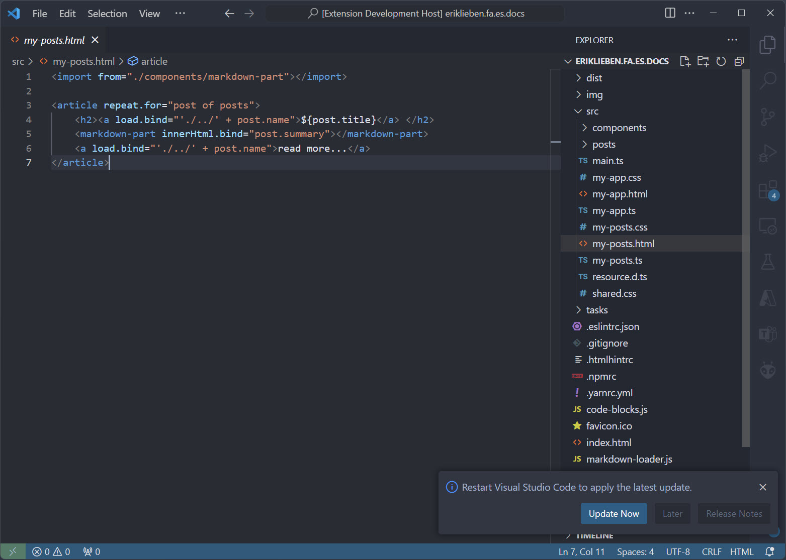
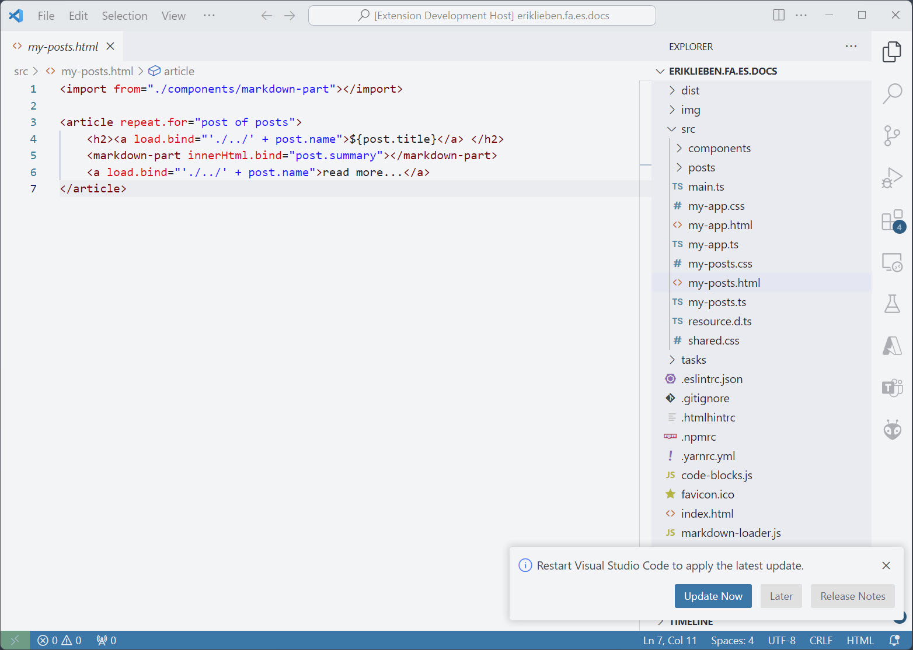

# My Visual Studio Code Themes
Welcome to my collection of Visual Studio Code themes! This repository contains two themes: a Dark Theme and a Light Theme, both inspired by the default Visual Studio Code Dark+ and Light+ themes, but with a softer color palette to make my coding sessions easier on the eyes.

I will adjust these themes to my preferences at the time, so they might change over time.

## Dark theme

## Light theme
I don't really use the Light theme, so it might still have some issues. Just need it from time to time.
